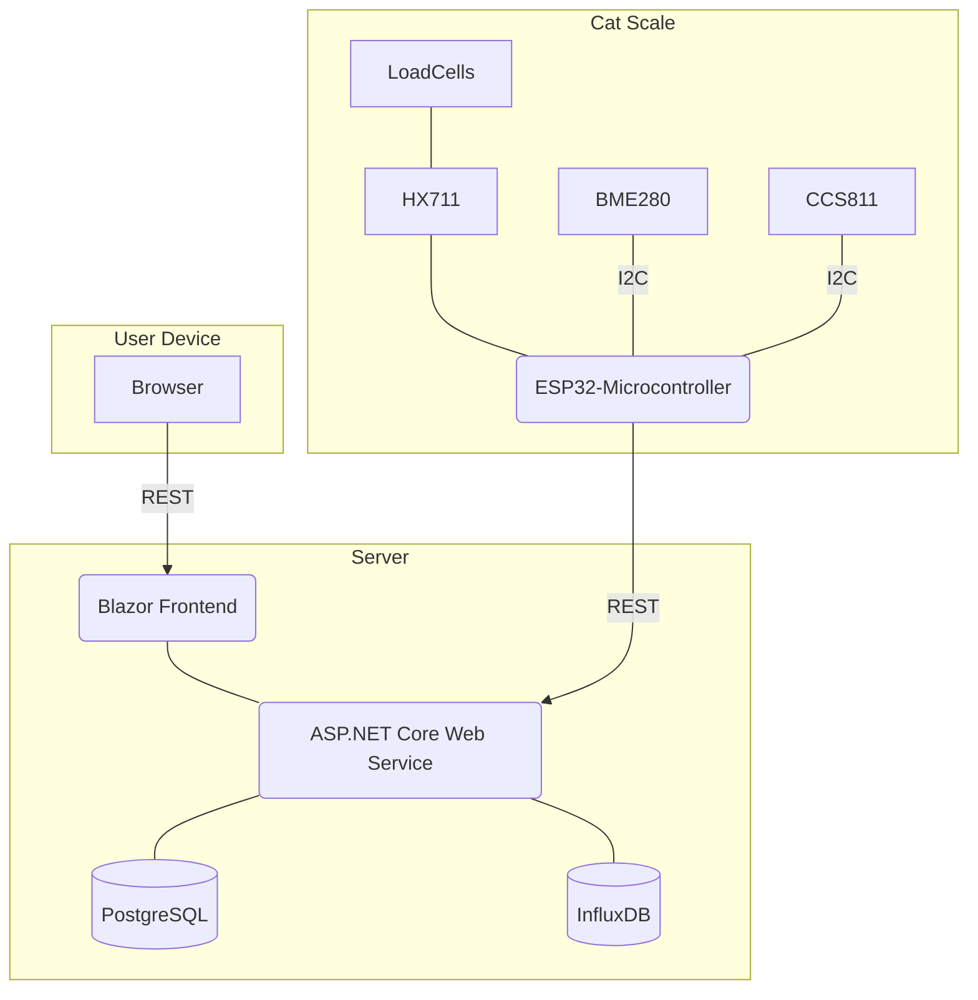

# Automated weight monitoring for chubby Cats 🐱🐱
[](https://github.com/mblk/cat-scale/actions/workflows/dotnet.yml)

This project is a hobby endeavor focused at monitoring and managing the weight of cats using an automated scale.

It consists of the following components:
- ESP32 microcontroller for weight measurement
- ASP.NET Core web service for data processing
- Blazor-based frontend for visualization and interaction

Data is stored in:
- PostgreSQL database for structured data
- InfluxDB for time series data

## Live System
Check it out here: [https://mblk.info/cathub](https://mblk.info/cathub/)

## Diagram



## Components

### 1. Microcontroller with Weight Cells
- **Description**: A microcontroller is connected to several sensors. It collects data and sends it to the web service for further processing.

- **Hardware**:
  - [ESP32](https://www.espressif.com/en/products/socs/esp32): A feature-rich MCU with integrated Wi-Fi and Bluetooth connectivity for a wide range of applications
  - [HX711](https://cdn.sparkfun.com/datasheets/Sensors/ForceFlex/hx711_english.pdf): 24-Bit Analog-to-Digital Converter (ADC) for Weight Scales
  - [BME280](https://www.bosch-sensortec.com/media/boschsensortec/downloads/datasheets/bst-bme280-ds002.pdf): Combined humidity and pressure sensor
  - [CCS811](https://cdn.sparkfun.com/assets/learn_tutorials/1/4/3/CCS811_Datasheet-DS000459.pdf): Sensor for monitoring indoor air quality

  The BME280 and CCS811 chips are connected to the ESP32 via a shared I2C-bus. The HX711 uses a custom serial protocol for communication.
  - Prototype: [Image 1](docs/hw_01.png), [Image 2](docs/hw_02.png)
  - TODO: Add schematic

- **Software**:
  - FreeRTOS-project using [ESP-IDF](https://docs.espressif.com/projects/esp-idf/en/latest/esp32/index.html)
  - Configures Wi-Fi connectivity and I2C devices on startup
  - Periodically reads sensor data and sends it to the web service via HTTPS/HTTP
  - Implements a custom filter cascade to clean up noisy signals
  - Supports Over-the-air (OTA) updates

- **Planned features**:
  - [ ] Attached camera for classification of cats (either locally on the ESP32 or through the web service)
  - [ ] Battery powered operation for simplified installation
  - [ ] Custom PCB and case

### 2. ASP.NET Core Web Service
- **Description**: A backend service that receives sensor data from the microcontroller, processes it, and stores it in a database. It also provides APIs for the frontend to retrieve and manage data.

- **Technologies**:
  - [ASP.NET Core](https://learn.microsoft.com/en-us/aspnet/core/introduction-to-aspnet-core)
  - [PostgreSQL](https://www.postgresql.org/)
  - [InfluxDB](https://www.influxdata.com/)

- **Features**:
  - RESTful APIs for data management
  - Integration with PostgreSQL for structured data storage
  - Integration with InfluxDB for time-series data

- **Planned features**:
  - [ ] Food/feeding management

### 3. Blazor Frontend
- **Description**: A user-friendly frontend built with ASP.NET Core Blazor to visualize and interact with the data collected by the system.

- **Technologies**:
  - [ASP.NET Core](https://learn.microsoft.com/en-us/aspnet/core/introduction-to-aspnet-core)
  - [Blazor](https://dotnet.microsoft.com/en-us/apps/aspnet/web-apps/blazor)

- **Features**:
  - Real-time data visualization (e.g., weight trends)
  - Graphs and charts to monitor cat weight and sensor data
  - User management and settings

- **Planned features**:
  - [ ] Try out Blazor Webassembly
  - [ ] Interactive graphs
  - [ ] Prettify design/layout

## Getting Started
1. **Initial Microcontroller Setup**:
   - ```cd esp/cat_scale```
   - ```idf.py menuconfig```: Set configuration for Wi-Fi, HTTP client, partition table
   - Set web service URI in http_secrets.h (TODO: add example)
   - ```idf.py build```
   - ```idf.py flash```

2. **Microcontroller Update**:
   - ```cd esp/cat_scale```
   - ```./build_and_update.sh```

2. **Run Backend locally**:
   - ```cd dotnet/CatScale.Service```
   - Set config in appsettings.json
   - ```dotnet run```

3. **Run Frontend locally**:
   - ```cd dotnet/CatScale.UI.BlazorServer```
   - Set config in appsettings.json
   - ```dotnet run```

4. **Deploy .NET services**:
   - ```scripts/publish_dotnet.sh```
   - ```scripts/deploy_to_vserver.sh``` (adjust it according to your own needs)

## Extras

Cat pics: [Picture 1](docs/cats_01.png)

## License
This project is open-source and available under the MIT License.
